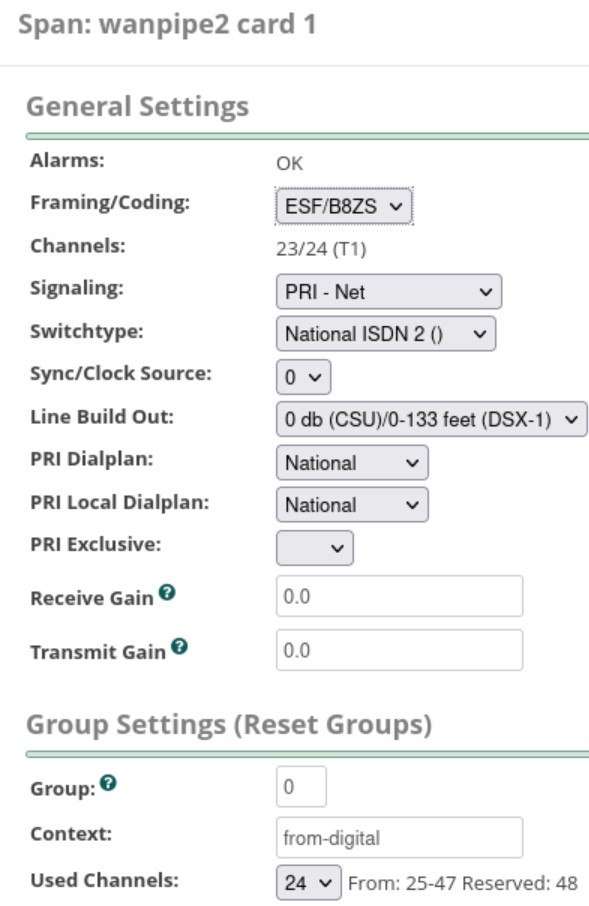

## DAHDI setup
- Cards used: Sangoma A102
- Number of VMs used: 2
- Path of DAHDI settings: FreePBX -> Connectivity -> DAHDI Config
- Since we are connecting two networks together, one card is set to work in PRI-NW mode (master) and the other in PRI-CPE mode (slave)

### Settings
#### Important
When setting up FreePBX with Cisco ISR, make sure to follow the config of VM 2. We need to set up ISR as the Network side and FreePBX (Sangoma card) as the CPE side.

#### VM 1 (PRI-NW)
- Sangoma settings. Note that port clocking is set to "Master". This is because this VM acts as the Master i.e. it derives its own clock and supplies it to the PRI-CPE card.

- Once Sangoma settings are set and DAHDI & Asterisk are restarted, this is how the Digital hardware overview should look like

- The next two images show span settings of two PRI interfaces

#### VM 2 (PRI-CPE)
- Sangoma settings are the same except for the port clocking. Here, it is set to Normal (syncs with the PRI-NW card)

- Span settings are the same except for the Signalling setting. Here, it is set to "PRI - CPE" instead of "PRI - Net"

## Port info
- wanpipe1 card 0 [1] corresponds to port A on the A102 physical card
- wanpipe2 card 1 [2] corresponds to port B on the A102 physical card